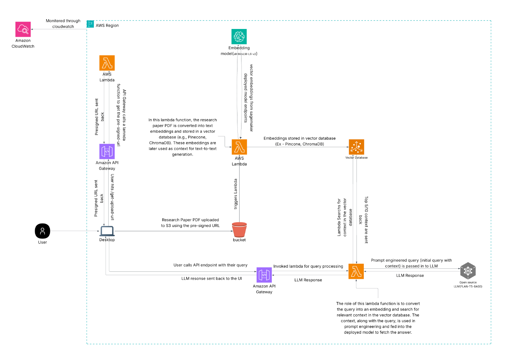

# 📄 DocuAsk – AI-Powered Document Q&A System

**DocuAsk** is a serverless GenAI application that enables users to upload research PDFs and ask natural language questions about the content. It combines semantic search, embeddings, and large language models (LLMs) to generate accurate, context-aware answers.

Developed as a mid-term project for **CSCI 5411 – Advanced Cloud Architecting** at Dalhousie University.

---

## 🧠 Project Summary

- **Problem**: Research papers and technical documents are long and hard to search.
- **Solution**: Users upload PDFs and ask questions. The system retrieves the most relevant text using vector search and generates answers using an LLM.
- **Architecture**: Built using serverless AWS services with Pinecone as the vector database and SageMaker for LLM inference.

---

## ⚙️ Key Features

- 📄 Upload PDF documents via React UI
- 🧾 Store and process files using **S3 + Lambda**
- 🔍 Embed document content with **MiniLM** on **SageMaker**
- 📚 Store semantic vectors in **Pinecone**
- 🗨️ Answer user questions using **Flan-T5** (LLM)
- 🔌 Event-driven pipeline with API Gateway and Lambda
- 🔒 Secure, scalable, and fault-tolerant architecture

---

## 🧱 Architecture Diagram

> 📝 The architecture diagram illustrates the full serverless pipeline, from file upload to semantic Q&A using SageMaker and Pinecone.

---

## 💰 Estimated Monthly Cost

| Service            | Purpose                      | Est. Monthly Cost |
|-------------------|------------------------------|-------------------|
| S3                | PDF storage                  | $0.23             |
| Lambda            | Processing & Q&A logic       | $8.00             |
| SageMaker         | MiniLM + Flan-T5 endpoints   | $10.35            |
| Pinecone          | Vector DB (free tier)        | $0.00             |
| API Gateway       | Lambda integration           | $0.35             |
| Amplify/Beanstalk | Frontend hosting             | $0.00             |
| CloudWatch        | Logs & monitoring            | $2.50             |
| **Total**         |                              | **~$21.43**       |

---

## 🧑‍💻 Author

**Shail Rajeshbhai Kardani**  

---

## 📄 License

This project was developed as part of coursework. All third-party tools and services retain their respective licenses.
